<!-- 

tensorboard --logdir=runs

conda activate /mnt/ntfs/learn_ML/test_classes/Тестовое\ Python\ ML,CV/Тестовое_ML/тестовое_ml/.conda 

-->

## EDA Report for Letter Dataset

### 1. Image Dimensions
- **All images have the same size:** 278×278 pixels
- **To save memory and speed up training** we will resize images to 64×64 pixels (preserving aspect ratio)

### 2. Class Imbalance
- **Total images:** 33,141
- **Mean per class:** 1,004.3
- **Minimum class:** Б (496 samples)
- **Maximum class:** Я (1,200 samples)
- **Imbalance ratio:** 2.42

**Impact assessment:** For a convolutional network, an imbalance of 2.42 is considered **moderate** and not critical. Modern CNNs are quite robust to this ratio.

**Solution:** Leave as is for now. If the model performs poorly on class Б, we will add:
- Class weights
- Augmentation for minority classes

### 3. Training Strategy
- **Not much data** (33k images) — risk of overfitting
- Will use a **simple convolutional network** (3-4 conv layers)
- Required regularization methods:
  - Dropout (0.3-0.5)
  - Early stopping
  - Data augmentation

### 4. Final Plan
1. Resize images to 64×64
2. Normalize pixels to [0, 1]
3. Train/val/test split (70/15/15)
4. Train simple CNN with regularization
5. Monitor performance on class Б

### 5. Risks
- **Overfitting** — due to limited amount of data
- **Class Б** — least represented (496 samples)
- **Mitigation:** augmentation + dropout + early stopping

## Class distribution


## Examples of letters from the dataset


## 📊 Training Results

### Loss Curves
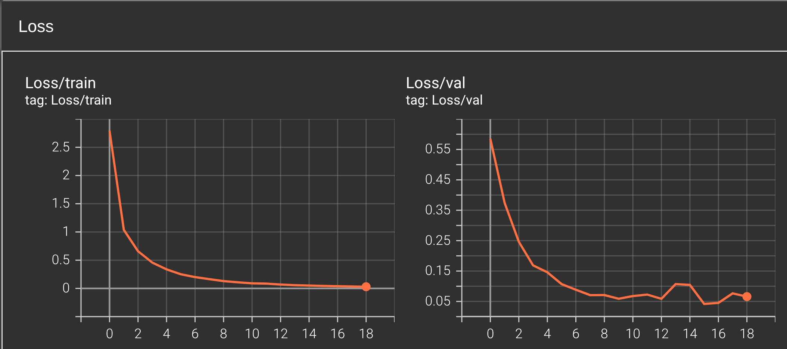

*Training completed in 20 epochs with early stopping*

### Accuracy
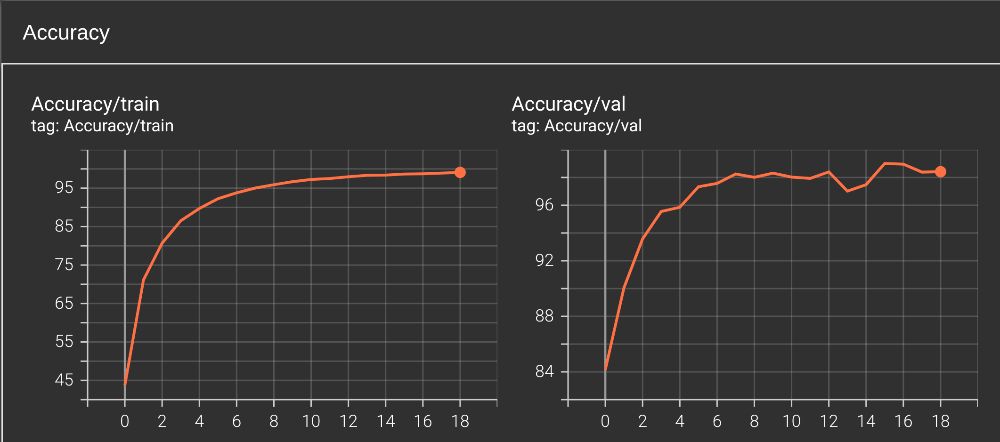

- **Best Validation Accuracy**: 98.42%
- **Test Accuracy**: ---%

### Data Augmentation Examples


## 🔍 Recognition Examples

| Original Image | Recognized Result |
|:--------------:|:-----------------:|
| 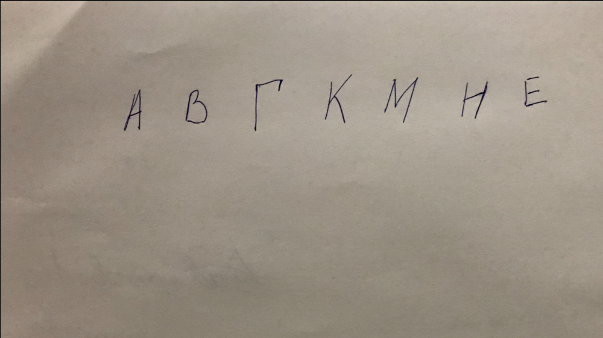 | 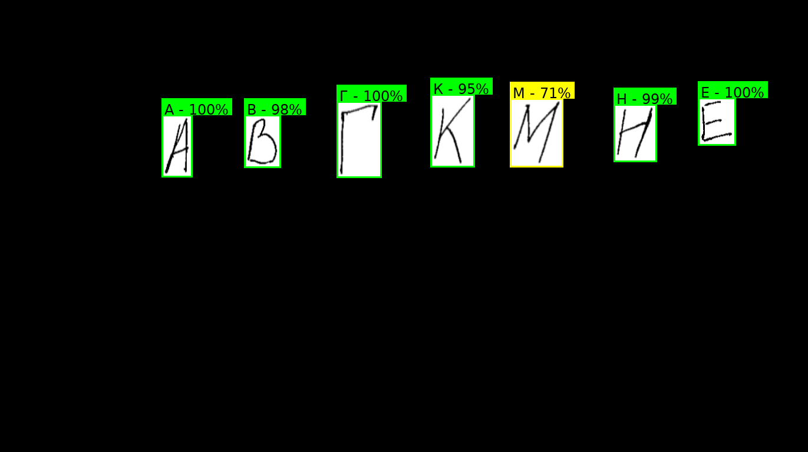 |
| 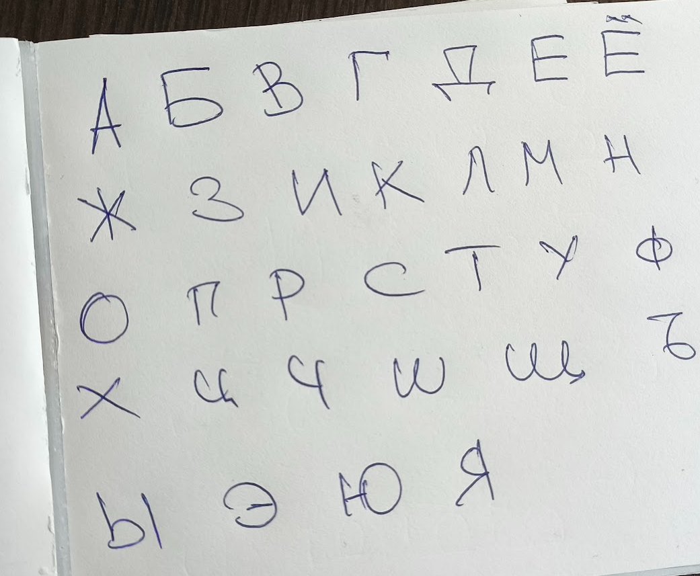 | 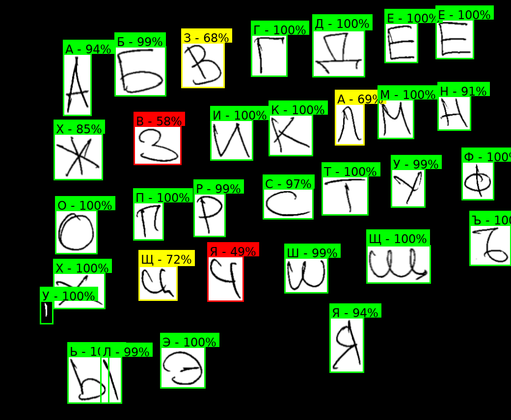 |
| 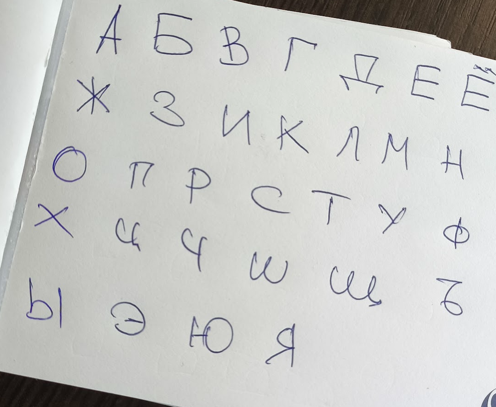 | 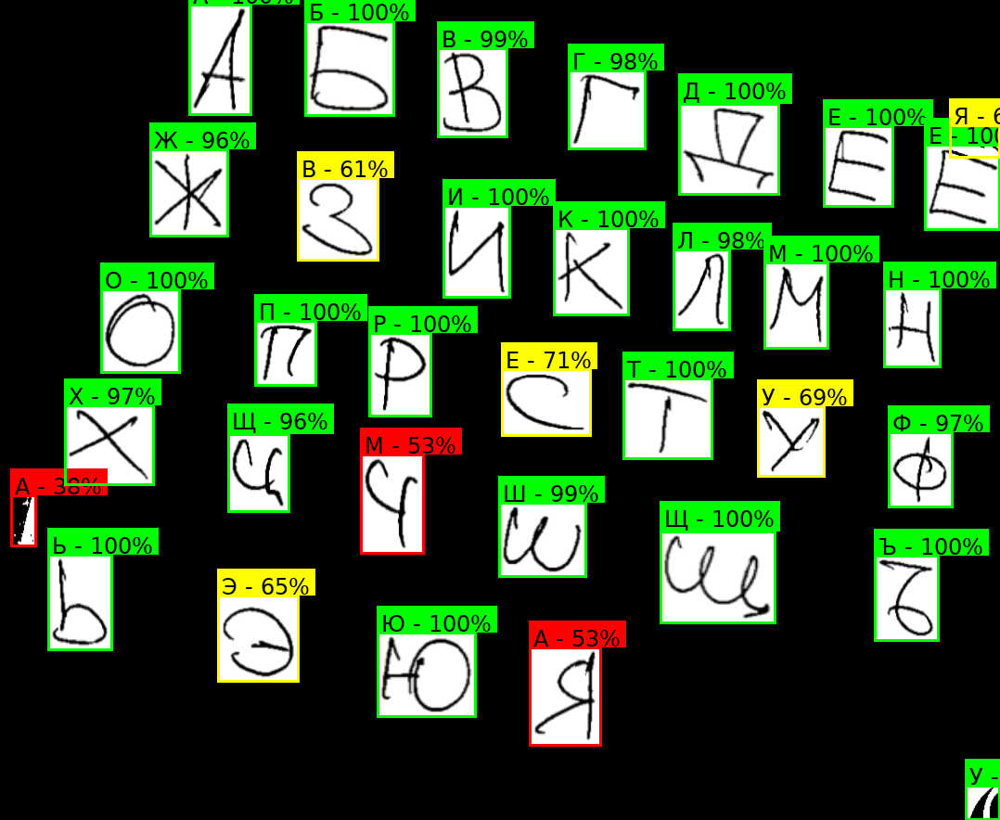 |
| 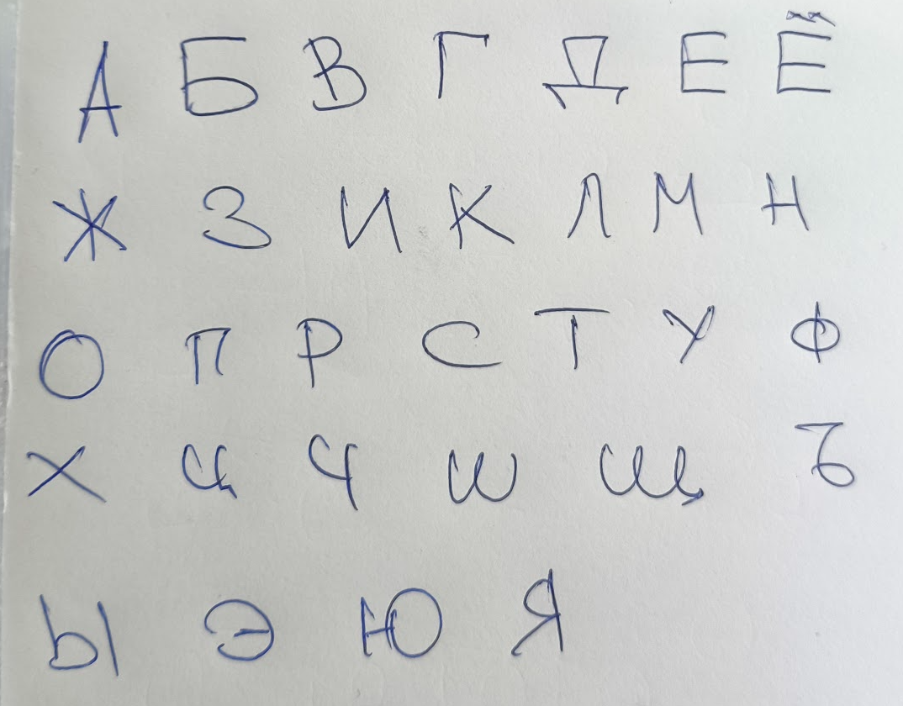 | 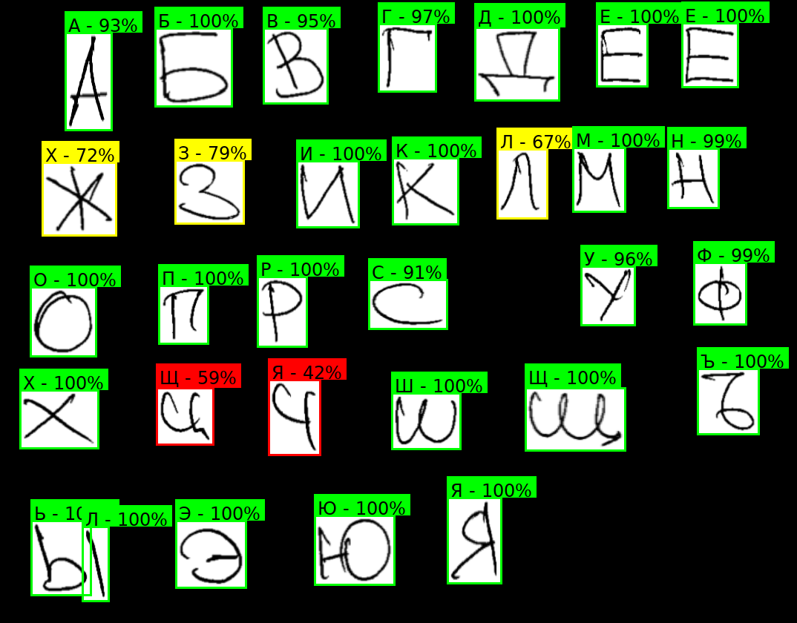 |

## Confusion matrix
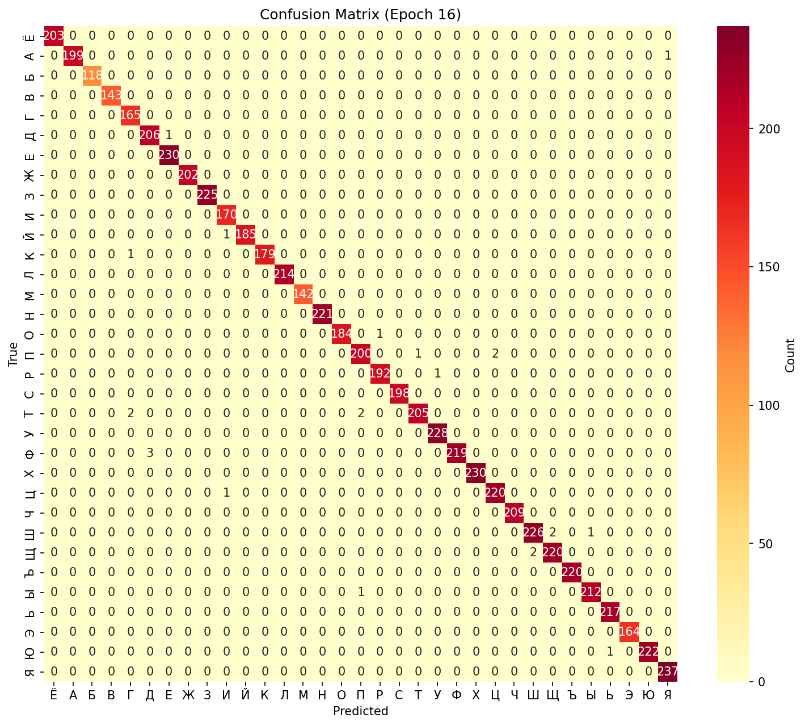

## 🏃‍♂️ Reproduce Results

```bash
conda env create -f environment.yaml
conda activate alphabet_env
python train.py
```


## 📋 TODO (Priority: 🔴 High → 🟡 Medium → 🟢 Low)

### Data Analysis
- 🔴 [ ] Add EDA results (class distribution, image statistics, sample visualizations)
- 🔴 [ ] Analyze misclassifications (which letters are most confused)
- 🟡 [ ] Add class weights to handle imbalanced data

### Baseline Models
- 🔴 [ ] Compare with HOG + SVM or RandomForest

### Model & Training Improvements
- 🔴 [ ] Check accuracy with smaller image size (32×32)
- 🟡 [ ] Add learning rate scheduling
- 🟡 [ ] Experiment with different optimizers (AdamW, SGD with momentum)
- 🟢 [ ] Implement k-fold cross validation
- 🟢 [ ] Add label smoothing
- 🟢 [ ] Implement mixup or cutmix augmentation
- 🟢 [ ] Add gradient clipping

### Evaluation & Metrics
- 🔴 [ ] Plot confusion matrix
- 🔴 [ ] Add precision, recall, F1-score per class
- 🟡 [ ] Calculate inference time (FPS) on CPU and GPU
- 🟢 [ ] Add top-2 and top-3 accuracy
- 🟢 [ ] Add ROC curves and AUC for each class

### Visualization & Debugging
- 🟡 [ ] Add Grad-CAM visualization
- 🟡 [ ] Save misclassified examples with predictions
- 🟢 [ ] Add model architecture diagram
- 🟢 [ ] Plot feature embeddings with t-SNE or UMAP
- 🟢 [ ] Add learning rate vs loss plot

### Environment & Reproducibility
- 🔴 [ ] Test environment files on a clean machine